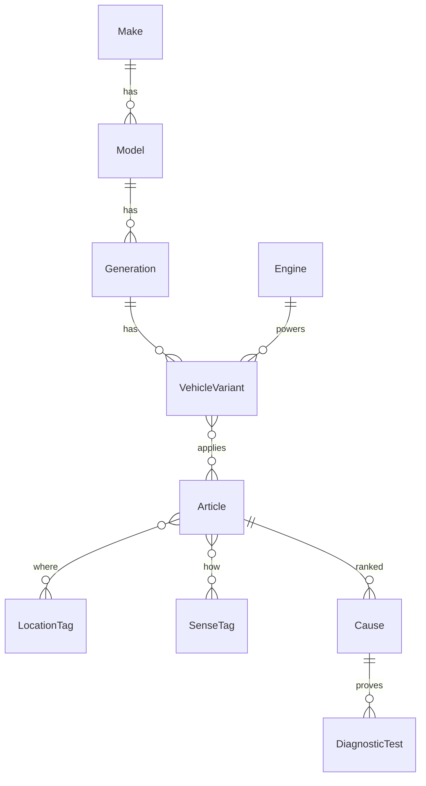

# Data model

The git catalog is compiled JSON. Drift imports that JSON into local SQLite and an FTS5 table named `articles_fts`.

## Article shape

Each article has:

- id, title, summary, severity
- location, sense, and system tags (including heritage `glass` and `leak`)
- symptoms, safety lock-outs, tools
- ranked causes, each with tests (how / pass / fail) and fix steps
- optional specs, parts, related ids, and public sources
- filters: generation, engine, model, year range, `requires48v`, or `universal`

## Filtering rules

- No garage vehicle: show everything
- Universal filter: always match
- `requires48v`: match only when the garage vehicle is flagged 48V
- Year bounds apply when a year is set on the garage vehicle

## Why JSON plus Drift

YAML and Python in `tool/` stay editable. `catalog.json` is the portable seed that works on iOS, Android, and web. Drift gives typed local queries and FTS on device. A later content-pack channel can replace the JSON without changing the schema.
