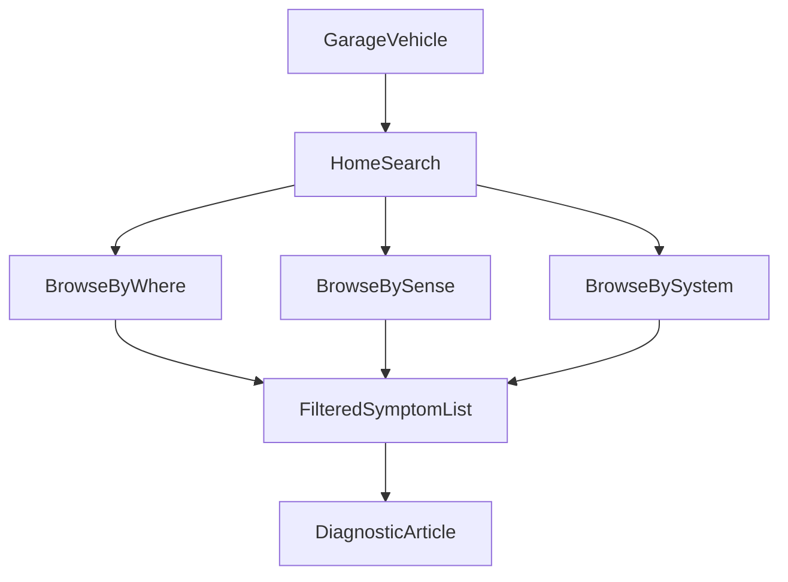

# Information architecture

Home starts from the garage vehicle, then the original ten mate paths, then where / sense / system browse plus search.

## Where

- Inside the cabin
- Outside the body
- Engine bay / motor
- Front end
- Rear, tray, and tailgate
- Undercarriage
- Wheels and tyres
- Electrical 12V and 48V
- Glass and windscreen

## How it shows up

- Sound
- Look
- Performance
- Smell
- Feel
- Fluid leak

## Systems

Shared mechanical systems plus a first-class **48V V-Active / MHEV** chapter.

A garage vehicle filters every list. Universal articles still appear. Model-specific articles hide when the generation, engine, year, or 48V flag does not match.

## Original mate paths

The Unity VDH home tiles map here:

| Original tile | Flutter route |
| --- | --- |
| Electrical | location / electrical |
| Noise | sense / sound |
| Fluid leak | sense / leak |
| Smell | sense / smell |
| Steering | system / steering-suspension |
| Tyres | location / wheels |
| Vibration | sense / feel |
| Glass | location / glass |
| Body interior | location / inside |
| Body exterior | location / outside |

See [heritage.md](heritage.md).
